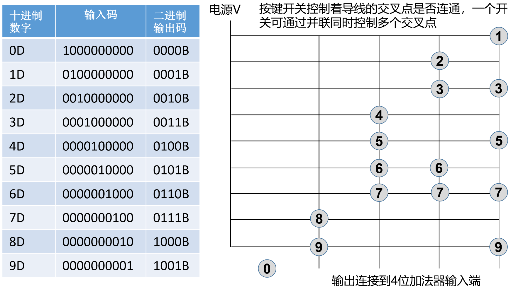
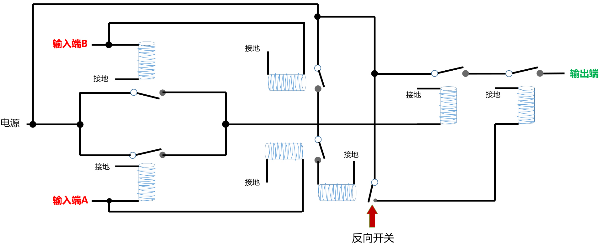
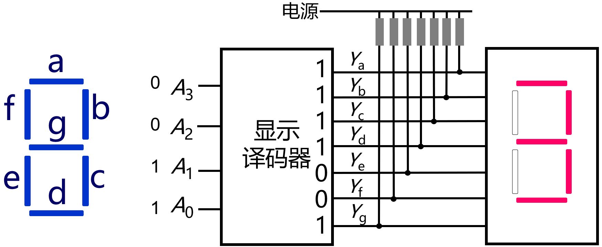

## 第一章 电控开关——计算机世界的基石

错误：

| 页码 | 具体位置 | 原内容                             | 修改后的内容                         | 贡献者 |
| ---- | -------- | ---------------------------------- | ------------------------------------ | ------ |
| P5   |右上        | 口子框                             | 口字框                               | -      |
| P6   |左上        | RICS                               | RISC                                 | -      |
| P10  | 右中       | 其本质上也是有多个逻辑门电路       | 其本质上也是由多个逻辑门电路         | -      |
| P10  | 左下| **S(Summary)** 为加和的信号输出， **C(Carrier)** |**S(Sum)** 为加和的信号输出，**C(Carry)**|-|
|P8|右下|异或门又被称为半加器，因为它只能输出和位而输出不了进位。异或门再加上一个与门，就组成了全加器（或者说加法器），|删除这些字||
|P11|右中|、半加器和全加器|删除这些字||
|P11|右中|前人将这种加法器称为全加器，而将之前的加法器称为半加器|前人将这种带进位输入信号的加法器称为全加器，而将之前不带进位输入信号的加法器称为半加器||
| P13  | 右上        | “."右侧的红色引号                   | 颜色变为黑色                       |-      |
| P13 | 左中 | “也就，”  | 去掉  “也就，” |  |
|P14|左下部分|公式里的所有的“i”应该是下标|公式里的所有的“i”改为下标||
|P15|左侧|C0=C0 C1=A1B1+（A1⊕B1）C0 C2=A2B2+（A2⊕B2）（A1B1+（A1⊕B1）C0） C3=A3B3+（A3⊕B3）（A2B2+（A2⊕B2）（A1B1+ （A1⊕B1）C0）） C4=A4B4+（A4⊕B4）（A3B3+（A3⊕B3）（A2B2+ （A2⊕B2）（A1B1+（A1⊕B1）C0））） S1= A1⊕B1⊕（A1B1+（A1⊕B1）C0） S 2= A2⊕B2⊕ （A2B2+ （A2⊕B2） （A1B1+ （A1⊕B1）C0）） S 3= A3⊕B3⊕ （A3B3+ （A3⊕B3） （A2B2+ （A2⊕B2）（A1B1+（A1⊕B1）C0））） S 4= A4⊕B4⊕ （A4B4+ （A4⊕B4） （A3B3+ （A3⊕B3）（A2B2+（A2⊕B2）（A1B1+（A1⊕B1） C0））））|C0=C0 C1=A1B1+（A1⊕B1）C0 C2=A2B2+（A2⊕B2）（A1B1+（A1⊕B1）C0） C3=A3B3+（A3⊕B3）（A2B2+（A2⊕B2）（A1B1+ （A1⊕B1）C0）） C4=A4B4+（A4⊕B4）（A3B3+（A3⊕B3）（A2B2+ （A2⊕B2）（A1B1+（A1⊕B1）C0））） S1= A1⊕B1⊕（A0B0+（A0⊕B0）C0） S 2= A2⊕B2⊕ （A1B1+ （A1⊕B1） （A0B0+ （A0⊕B0）C0）） S 3= A3⊕B3⊕ （A2B2+ （A2⊕B2） （A1B1+ （A1⊕B1）（A0B0+（A0⊕B0）C0））） S 4= A4⊕B4⊕ （A3B3+ （A3⊕B3） （A2B2+ （A2⊕B2）（A1B1+（A1⊕B1）（A0B0+（A0⊕B0） C0））））||
|P17  | 倒数第二段结尾 |也就是当R和S同时为0时，触发了电路的记忆性。此时，如果S的值从0变为1，并不会导致Q值从0变为1，Q值依然保持之前的值（0）。或者说，当R值为1时，输出端Q值会与输入端S值保持相等且跟随S的值同步变化，但是一旦R值从1变为0后，则此后不管S的值怎么变化，Q值恒定为R值从1变到0之前时的那个值。   |也就是当R=0、S=1时，触发了电路的记忆性。此时，如果S的值从1变为0，并不会导致Q值从1跟随着也变为0，Q值依然保持之前的值1。所以说，上述这个电路可以锁住1这个值。 |  |
|P17|图1-16||||
| P25 |右侧  |“时钟信号（Clock，CLK）”  | 加粗处理 |  |
|P25|左上第1行开始|既然Q’和Q频率都是一半，那么实际使用中到底是用哪个输出呢？根据图1-31，看上去用Q’更为合适，因为锁存信号为1的时候，Q’也为1，而不是Q的0。但是如果把Q的信号的第一个周期截断丢弃，也可以像Q’一样从1开始振荡。习惯上，Q’是副输出，Q才是主输出，还是用Q符合习惯。如果初始的时候给D端输入1，锁存端也输入1，那么你会发现，此时Q而不是Q’的输出便会从1开始，也就可以与锁存信号对齐了，这相当于两个人同时都迈出左脚。|在实际应用中，人们采用Q端输出信号与上下游电路相连接，而忽略Q'端的信号||
| P26 |右上  |名曰“清零”  |清零二字加粗处理  |  |
| P30 |右下  |翻译成7栈灯泡亮灭  |翻译成7盏灯泡的亮灭  |  |
| P31 |右中  |输出值，，  |输出值，  |  |
|P32|左中|表明将A的信号|表明将D的信号||
|P32|左中|表明把B的信号|表明将C的信号||
|P33|左上|全是1才，输出1，|全是1才输出1，||
| P34  | 右中        | W1=0   | W1=1   | -|
| P35 | 右侧 |1234D=1×1+2×10+3×100+4×1000  |1234D=1×1000+2×100+3×10+4×1  |  |
| P39 | 右中 | 如果能够这些电流变化记录下来 | 如果能够 **将** 这些电流变化记录下来 |
|P46  |右中下  | 上升到32位 |上升到5位  |  |
|P52|二维码|外网链接无法访问|                                ||
| P62 | 右下| 统一场轮|统一场论|-|
|P63|左上角|需要的发射天线太长|需要较长的发射天线||
|P74|右中提示框|整体替换为新内容|图1-108中的导线并不体现数量，只体现了架构关系。比如拥有4个输入的MUX其控制信号至少要两根导线。后续架构图如无必要中也不再标识导线数量（位宽）。||
|p76  |右下倒数第二行|图1-29是一个4位计数器|图1-32是一个4位计数器||
|P78|左中|比如，共享FIFO共可容纳1024条数据（10个地 址信号就可以表示1024个地址了），可以为发送方 #1分配256条，那么发送方#1对应的指针队列就是 log2256=8条，每条的容量是10位（因为发送方#1发过 来的数据可能被存储在1024条记录中的任何一条）。|比如，共享FIFO共可容纳1024条数据（10个地 址信号就可以表示1024个地址了，所以用于该FIFO的选路器需要有10根控制信号线）。假设为发送方 #1分配这1024条中的256条作为一个逻辑队列，那么发送方#1对应的指针队列就需要有256条记录，每条记录的容量是10位（发送方#1发过 来的数据可能被存储在1024条记录中的任何一条中）。||||
|P82|左提示框|“但是将动力传送系统与车轮临时脱开”|“但是将发动机输出与传动系统临时脱开”||
|P83|左上|异步清零，|去掉“异步清零，”||
|P92|二维码|外网链接无法访问|||
|P96|图题1-131|加减乘数|加减乘除||
|P99|左边第16行|那就是在第一步中被反馈回来的数值A|那就是在第一步中被输入的数值A||

建议：

| 页码 | 具体位置               | 原内容 | 修改后的内容 | 贡献者 |
| ---- | ---------------------- | ------ | ------------ | ------ |
| P6   |图1-2    | 电路触点的圆点太小 |   | -      |
| P16 | 右下 | 我是废了老劲也没想出来，其实有一些特定方法能够从真值表推导出逻辑表达式，有兴趣的读者可自行学习。 | 我是废了老劲也没想出来，其实有一些特定方法能够从真值表推导出逻辑表达式，详见1.3.5一节。|  |
| P24 |图1-29下方  |叫做反馈  | 反馈二字加粗处理 |  |
| P24 |  |假设我们一开始给这个电路的D端输入0，锁存端输入1，电路达到稳态后，A=0且被锁定，B=1且被锁定  | 假设我们一开始给这个电路的D端输入0，锁存端输入1，此时A和B的值是随机的，假设电路达到稳态后A=0且被锁定，B=1且被锁定 |  |
| P31   |图1-43    | 显示译码器的输出端，word拼写检查的红色波浪线 |   |       |
