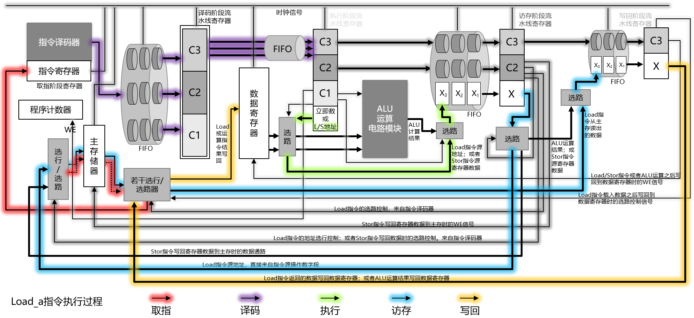

## [第四章 电路执行过程的进化——流水线、分支预测、乱序执行与多发射

错误：

| 页码 | 具体位置               | 原内容 | 修改后的内容 | 贡献者 |
| ---- | ---------------------- | ------ | ------------ | ------ |
| P260   | 左中 | 没发出 | 每发出 | -      |
|P263|右第3段第7行|998|999|2019-07-28|
|P263|右倒数第3段最后一行|吞吐量=并行度×1000ms/节点时延|吞吐量=1000ms/节点时延或者吞吐量=并发度×1000ms/传递链总时延|2019-07-28|
|P275|从下往上数第3根线|"stor指令写回寄存器数据到主存时的数据通路"标蓝色| ||
|P281|右下倒数第3行|图4-34|图4-35||
|P283|图4-34图题|结尾多了一个“女”字|去掉“女”字||
|P291|右下倒数第2行|于......|与......||
|P297|左倒数11行|寄存器A|寄存器B||
|P326|右倒数第4行|如果想要实现运算|如果想要实现通用运算|2019-08-08|
|脑图|-|按照原有顺序比呈现|按照原有顺序呈现||
|脑图|左下|追踪跳和描述转历史|追踪和描述跳转历史||
|脑图|右倒数第3框|受音影响|受影响||

建议：

| 页码 | 具体位置               | 原内容 | 修改后的内容 | 贡献者 |
| ---- | ---------------------- | ------ | ------------ | ------ |
|    |  |  |  | -      |
