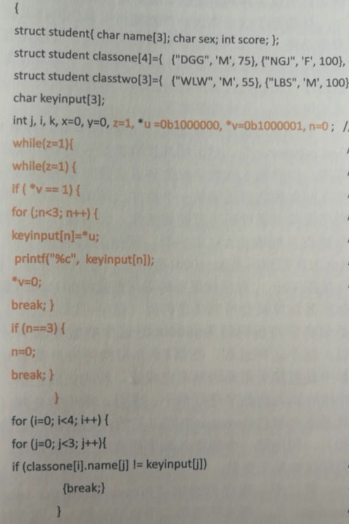
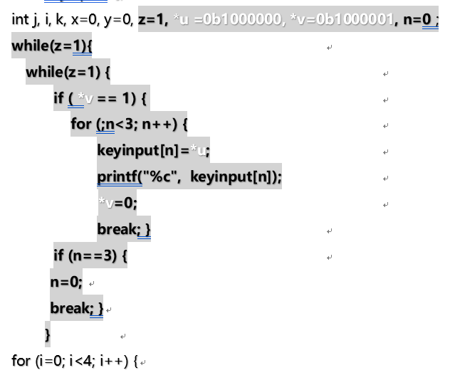

## 第五章 程序世界——从机器码到操作系统

错误：

| 页码 | 具体位置               | 原内容 | 修改后的内容 | 贡献者 |
| ---- | ---------------------- | ------ | ------------ | ------ |
|  P340 |左中  |else if a=red  | else if a==red | -      |
|P353|左下|  |  ||

建议：

| 页码 | 具体位置               | 原内容 | 修改后的内容 | 贡献者 |
| ---- | ---------------------- | ------ | ------------ | ------ |
|  |  |  |  | -      |
